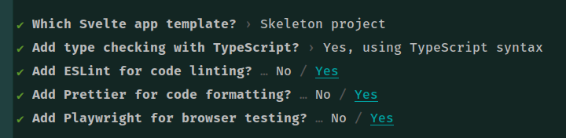

## ** STEPS **

#### Project setup
npm init svelte@next gql



#### Tailwind Setup
yarn add -D autoprefixer postcss-cli tailwindcss concurrently cross-env

touch ./postcss.config.cjs
```cjs
module.exports = {
    plugins: {
        autoprefixer: {},
        tailwindcss: {},
    }
}
```

npx tailwindcss init tailwind.config.cjs

mkdir src/styles

touch src/styles/tailwind.scss

```scss
@tailwind base;
@tailwind components;
@tailwind utilities;
```

#### Tailwind Setup
touch ./postcss.config.cjs

yarn add @graphql-codegen/cli -D

yarn add @graphql-codegen/introspection @graphql-codegen/named-operations-object -D

yarn add @graphql-codegen/typescript @graphql-codegen/typescript-operations -D

yarn add @graphql-codegen/typescript-urql @graphql-codegen/urql-introspection @graphql-codegen/urql-svelte-operations-store -D

yarn add @urql/svelte urql graphql

```json
  "scripts": {
    "generate": "grapql-codegen --config codegen.yml"
  },
```
